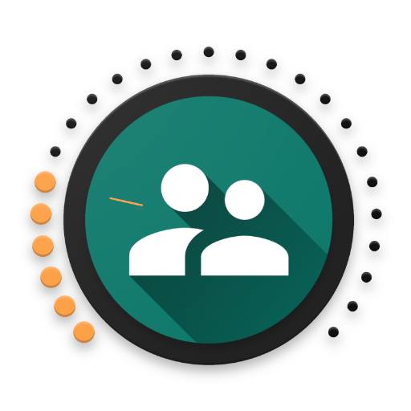
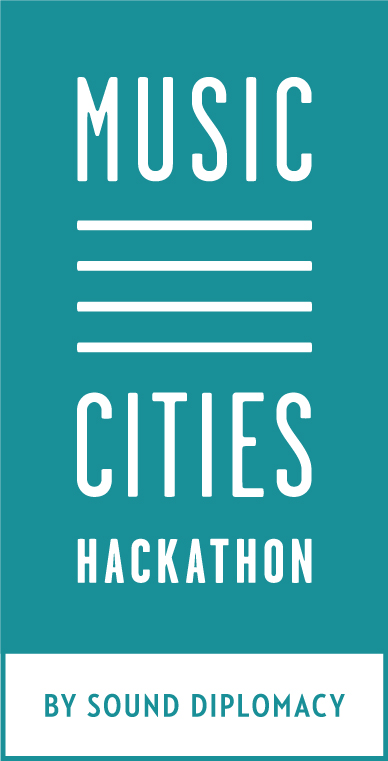

With the Social Volume Knob app for Android you give people in your vicinity the ability to adjust the volume of the music you are currently listening to.

Give peolple in your vicinity access to your volume control on your Android device.
Print out the qr-code and hand it out to the people. After scanning the qr-code the Cocial Volume Knob app will be installed on their Android device and they can adjast the Volume of your music.

With this qr-code you can adjust the volume of user: ligi
Scan the qr-code, install the app, adjust the volume, enjoy your time

Benefits:

 * happy music loving citizens that can turn up the music if nobody is negatively affected
 * happy neighbours that can enjoy a quiet environment when they want to
 * useful data (currently it is hard to predict when you are able to turn up the music without affecting your neighbours in a negative way)

possible extensions:
 - equalizer access (bass travels further)
 - authorization by tapping the beat you hear ;-)
 - authorization by automatically recognizing the beat you hear

Started implementation at music cities sounddiplomacy hackathon.

Developed by ligi https://github.com/ligi
Design by Dierk Eichel https://github.com/deichel
